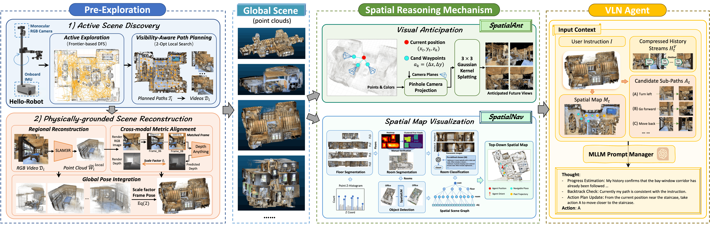

<div align="center">
  <h1 id="Spatial-X Big-Title" class="title is-2 publication-title" style="text-align: center;">
      
      Spatial-X: Zero-Shot Vision-and-Language Navigation with Global Scene Priors
  </h1>
  <div class="is-size-5 publication-authors">
      <span class="author-block"><b style="color:#f67846; font-weight:normal">&#x25B6 </b> Fudan University </b></span>
      <span class="author-block"><b style="color:#008AD7; font-weight:normal">&#x25B6 </b> Adelaide University </span>
      <br>
      <span class="author-block"><b style="color:#F2A900; font-weight:normal">&#x25B6 </b> Shanghai Innovation Institute </span>
      <span class="author-block"><b style="color:#00f2ee; font-weight:normal">&#x25B6 </b> University of Southern California </span>
  </div>
  <br>
  <a href="https://imnearth.github.io/Spatial-X/" target="_blank">
      
  </a>
  <a href="https://github.com/IMNearth/Spatial-X" target="_blank">
    
  </a>
  <a href="https://github.com/IMNearth/Spatial-X" target="_blank">
    
  </a>
  <a href="https://creativecommons.org/licenses/by-nc-sa/4.0/deed.en" target="_blank">
    
  </a>
</div>
<br>

This repository contains the code and data for our **series of work** on **zero-shot Vision-and-Language Navigation (VLN)** using **global spatial scene priors**. We are the first to <span style="color: blue; font-weight: bold;">close-loop the pre-exploration to physically grounded 3D scene reconstructions</span> (i.e. point clouds) for VLN agents and <span style="color: blue; font-weight: bold;">investigate how pre-explored 3D scene priors can provide a robust reasoning basis</span> for MLLM-based agents in multiple ways.

The overall framework is summarized below:




## 🍻 News & TODOs
- [x] **2026-04-05**: Release the raw code of **SpatialNav** agent. (Dependencies and instructions comming soon...)
- [ ] Release the data of predicted spatial scene graph on perfect human-crafted point clouds.
- [ ] Release the raw code of environment exploration and scene reconstruction.
- [ ] Release the data of agent-reconstructed noisy scene point clouds.
- [ ] Release the raw code of SpatialAnt agent.


## 📚 Our Series of Works

### SpatialNav: Leveraging Spatial Scene Graphs for Zero-Shot Vision-and-Language Navigation [](https://arxiv.org/abs/2601.06806) 

<div>
    <span class="author-block"><a href="https://imnearth.github.io/">Jiwen Zhang</a>,</span>
    <span class="author-block"><a href="https://junction4nako.github.io/">Zejun Li</a>,</span>
    <span class="author-block"><a href="https://siyuanwangw.github.io/">Siyuan Wang</a>,</span>
    <span class="author-block"><a href="https://scholar.google.com/citations?user=hjp3bMYAAAAJ&hl=en">Xiangyu Shi</a>, </span>
    <span class="author-block"><a href="http://www.fudan-disc.com/people/zywei">Zhongyu Wei</a><sup>†</sup>,</span>
    <span class="author-block"> <a href="https://v3alab.github.io/">Qi Wu</a>.</span>
</div>
<br>

> We propose a zero-shot VLN setting that allows agents to pre-explore the environment, and construct the **Spatial Scene Graph (SSG)** to capture global spatial structure and semantics. Based on SSG, **SpatialNav** integrates **an agent-centric spatial map**, compass-aligned visual representation, and remote object localization for efficient navigation. SpatialNav significantly outperforms existing zero-shot agents and narrows the gap with state-of-the-art learning-based methods.

### SpatialAnt: Autonomous Zero-Shot Robot Navigation via Active Scene Reconstruction and Visual Anticipation [](https://arxiv.org/abs/2603.26837)

<div>
  <span class="author-block"><a href="https://imnearth.github.io/">Jiwen Zhang</a>,</span>
  <span class="author-block"><a href="https://scholar.google.com/citations?user=hjp3bMYAAAAJ&hl=en">Xiangyu Shi</a>,</span>
  <span class="author-block"><a href="https://siyuanwangw.github.io/">Siyuan Wang</a>,</span>
  <span class="author-block"><a href="https://scholar.google.com/citations?user=hr5FDjMAAAAJ&hl=en">Zerui Li</a>,</span>
  <span class="author-block"><a href="http://www.fudan-disc.com/people/zywei">Zhongyu Wei</a><sup>†</sup>,</span>
  <span class="author-block"><a href="https://v3alab.github.io/">Qi Wu</a>.</span>
</div>
<br>

> Building on SpatialNav, **SpatialAnt** addresses the reality gap when deploying pre-exploration-based agents on real robots. We introduce a **physical grounding strategy** to recover metric scale from monocular RGB-based reconstructed scene point clouds. We further design a **visual anticipation mechanism** that renders future observations from noisy point clouds for counterfactual reasoning. SpatialAnt achieves state-of-the-art zero-shot performance in both simulation and real-world deployment on the Hello Robot.


## Installation

(Coming soon ...)


## Performance

### Results in Discrete Environments

* The <b>best</b> and the <ins>second best</ins> results **within each group** are denoted by <b>bold</b> and <ins>underline</ins>.

<div style="overflow-x: auto; font-family: sans-serif; font-size: 0.85em; display: flex; flex-direction: column; align-items: center;">
  <table style="width: 100%; max-width: 1000px; border-collapse: collapse; text-align: center; border-top: 2px solid #333; border-bottom: 2px solid #333;">
    <thead>
      <tr>
        <th rowspan="2" style="padding: 8px; border-bottom: 1px solid #aaa; text-align: left;">Methods</th>
        <th rowspan="2" style="padding: 8px; border-bottom: 1px solid #aaa;">Pre-Exp</th>
        <th colspan="5" style="padding: 8px; border-bottom: 1px solid #aaa;">R2R</th>
        <th colspan="3" style="padding: 8px; border-bottom: 1px solid #aaa;">REVERIE</th>
      </tr>
      <tr>
        <th style="padding: 8px; border-bottom: 1px solid #333;">TL(↓)</th>
        <th style="padding: 8px; border-bottom: 1px solid #333;">NE(↓)</th>
        <th style="padding: 8px; border-bottom: 1px solid #333;">OSR(↑)</th>
        <th style="padding: 8px; border-bottom: 1px solid #333;">SR(↑)</th>
        <th style="padding: 8px; border-bottom: 1px solid #333;">SPL(↑)</th>
        <th style="padding: 8px; border-bottom: 1px solid #333;">OSR(↑)</th>
        <th style="padding: 8px; border-bottom: 1px solid #333;">SR(↑)</th>
        <th style="padding: 8px; border-bottom: 1px solid #333;">SPL(↑)</th>
      </tr>
    </thead>
    <tbody>
      <tr style="background-color: #e6f2ff;">
        <td colspan="10" style="padding: 8px; text-align: left;"><b><i>Supervised Learning:</i></b></td>
      </tr>
      <tr>
        <td style="padding: 8px; text-align: left;">NavCoT</td>
        <td style="padding: 8px;">--</td>
        <td style="padding: 8px;">9.95</td>
        <td style="padding: 8px;">6.36</td>
        <td style="padding: 8px;">48</td>
        <td style="padding: 8px;">40</td>
        <td style="padding: 8px;">37</td>
        <td style="padding: 8px;">14.2</td>
        <td style="padding: 8px;">9.2</td>
        <td style="padding: 8px;">7.2</td>
      </tr>
      <tr>
        <td style="padding: 8px; text-align: left;">PREVALENT</td>
        <td style="padding: 8px;">--</td>
        <td style="padding: 8px;">10.19</td>
        <td style="padding: 8px;">4.71</td>
        <td style="padding: 8px;">-</td>
        <td style="padding: 8px;">58</td>
        <td style="padding: 8px;">53</td>
        <td style="padding: 8px;">--</td>
        <td style="padding: 8px;">--</td>
        <td style="padding: 8px;">--</td>
      </tr>
      <tr>
        <td style="padding: 8px; text-align: left;">VLN-BERT</td>
        <td style="padding: 8px;">--</td>
        <td style="padding: 8px;">12.01</td>
        <td style="padding: 8px;">3.93</td>
        <td style="padding: 8px;">69</td>
        <td style="padding: 8px;">63</td>
        <td style="padding: 8px;">57</td>
        <td style="padding: 8px;">27.7</td>
        <td style="padding: 8px;">25.5</td>
        <td style="padding: 8px;">21.1</td>
      </tr>
      <tr>
        <td style="padding: 8px; text-align: left;">HAMT</td>
        <td style="padding: 8px;">--</td>
        <td style="padding: 8px;">11.46</td>
        <td style="padding: 8px;"><ins>2.29</ins></td>
        <td style="padding: 8px;">73</td>
        <td style="padding: 8px;">66</td>
        <td style="padding: 8px;"><ins>61</ins></td>
        <td style="padding: 8px;">36.8</td>
        <td style="padding: 8px;">33.0</td>
        <td style="padding: 8px;">30.2</td>
      </tr>
      <tr>
        <td style="padding: 8px; text-align: left;">DUET</td>
        <td style="padding: 8px;">--</td>
        <td style="padding: 8px;">13.94</td>
        <td style="padding: 8px;">3.31</td>
        <td style="padding: 8px;"><ins>81</ins></td>
        <td style="padding: 8px;"><ins>72</ins></td>
        <td style="padding: 8px;">60</td>
        <td style="padding: 8px;"><ins>51.1</ins></td>
        <td style="padding: 8px;"><ins>47.0</ins></td>
        <td style="padding: 8px;"><ins>33.7</ins></td>
      </tr>
      <tr>
        <td style="padding: 8px; text-align: left;">DUET+ScaleVLN</td>
        <td style="padding: 8px;">--</td>
        <td style="padding: 8px;">14.09</td>
        <td style="padding: 8px;"><b>2.09</b></td>
        <td style="padding: 8px;"><b>88</b></td>
        <td style="padding: 8px;"><b>81</b></td>
        <td style="padding: 8px;"><b>70</b></td>
        <td style="padding: 8px;"><b>63.9</b></td>
        <td style="padding: 8px;"><b>57.0</b></td>
        <td style="padding: 8px;"><b>41.8</b></td>
      </tr>
      <tr style="background-color: #e6f2ff;">
        <td colspan="10" style="padding: 8px; text-align: left;"><b><i>Zero-Shot:</i></b></td>
      </tr>
      <tr>
        <td style="padding: 8px; text-align: left;">NavGPT</td>
        <td style="padding: 8px;">&#10005;</td>
        <td style="padding: 8px;">11.45</td>
        <td style="padding: 8px;">6.46</td>
        <td style="padding: 8px;">42</td>
        <td style="padding: 8px;">34</td>
        <td style="padding: 8px;">29</td>
        <td style="padding: 8px;">28.3</td>
        <td style="padding: 8px;">19.2</td>
        <td style="padding: 8px;">14.6</td>
      </tr>
      <tr>
        <td style="padding: 8px; text-align: left;">MapGPT</td>
        <td style="padding: 8px;">&#10005;</td>
        <td style="padding: 8px;">--</td>
        <td style="padding: 8px;">5.63</td>
        <td style="padding: 8px;">57.6</td>
        <td style="padding: 8px;">43.7</td>
        <td style="padding: 8px;">34.8</td>
        <td style="padding: 8px;">36.8</td>
        <td style="padding: 8px;">31.6</td>
        <td style="padding: 8px;">20.3</td>
      </tr>
      <tr>
        <td style="padding: 8px; text-align: left;">MC-GPT</td>
        <td style="padding: 8px;">&#10005;</td>
        <td style="padding: 8px;">--</td>
        <td style="padding: 8px;">5.42</td>
        <td style="padding: 8px;">68.8</td>
        <td style="padding: 8px;">32.1</td>
        <td style="padding: 8px;">--</td>
        <td style="padding: 8px;">30.3</td>
        <td style="padding: 8px;">19.4</td>
        <td style="padding: 8px;">9.7</td>
      </tr>
      <tr>
        <td style="padding: 8px; text-align: left;">SpatialGPT</td>
        <td style="padding: 8px;">&#10005;</td>
        <td style="padding: 8px;">--</td>
        <td style="padding: 8px;">5.56</td>
        <td style="padding: 8px;"><b>70.8</b></td>
        <td style="padding: 8px;">48.4</td>
        <td style="padding: 8px;">36.1</td>
        <td style="padding: 8px;">--</td>
        <td style="padding: 8px;">--</td>
        <td style="padding: 8px;">--</td>
      </tr>
      <tr>
        <td style="padding: 8px; text-align: left;"><b>SpatialNav (Ours)</b></td>
        <td style="padding: 8px;">&#10003;</td>
        <td style="padding: 8px;">13.8</td>
        <td style="padding: 8px;"><ins>4.54</ins></td>
        <td style="padding: 8px;"><ins>68.2</ins></td>
        <td style="padding: 8px;"><ins>57.7</ins></td>
        <td style="padding: 8px;"><ins>47.8</ins></td>
        <td style="padding: 8px;"><b>58.1</b></td>
        <td style="padding: 8px;"><ins>49.6</ins></td>
        <td style="padding: 8px;"><ins>34.6</ins></td>
      </tr>
    </tbody>
  </table>
</div>

### Results in Continuous Environments

* The <b>best supervised</b> results are highlighted in <b>bold</b>, while the <ins>best zero-shot</ins> results are <ins>underlined</ins>.  
* "Pre-Exp" denotes whether the zero-shot agent adopts the pre-exploration based navigation settings.

<div style="overflow-x: auto; font-family: sans-serif; font-size: 0.85em; display: flex; flex-direction: column; align-items: center;">
  <table style="width: 100%; max-width: 1000px; border-collapse: collapse; text-align: center; border-top: 2px solid #333; border-bottom: 2px solid #333;">
    <thead>
      <tr>
        <th rowspan="2" style="padding: 8px; border-bottom: 1px solid #aaa;">#</th>
        <th rowspan="2" style="padding: 8px; border-bottom: 1px solid #aaa; text-align: left;">Methods</th>
        <th rowspan="2" style="padding: 8px; border-bottom: 1px solid #aaa;">Pre-Exp</th>
        <th colspan="5" style="padding: 8px; border-bottom: 1px solid #aaa;">R2R-CE</th>
        <th colspan="4" style="padding: 8px; border-bottom: 1px solid #aaa;">RxR-CE</th>
      </tr>
      <tr>
        <th style="padding: 8px; border-bottom: 1px solid #333;">NE(↓)</th>
        <th style="padding: 8px; border-bottom: 1px solid #333;">OSR(↑)</th>
        <th style="padding: 8px; border-bottom: 1px solid #333;">SR(↑)</th>
        <th style="padding: 8px; border-bottom: 1px solid #333;">SPL(↑)</th>
        <th style="padding: 8px; border-bottom: 1px solid #333;">nDTW(↑)</th>
        <th style="padding: 8px; border-bottom: 1px solid #333;">NE(↓)</th>
        <th style="padding: 8px; border-bottom: 1px solid #333;">SR(↑)</th>
        <th style="padding: 8px; border-bottom: 1px solid #333;">SPL(↑)</th>
        <th style="padding: 8px; border-bottom: 1px solid #333;">nDTW(↑)</th>
      </tr>
    </thead>
    <tbody>
      <tr style="background-color: #e6f2ff;">
        <td colspan="12" style="padding: 8px; text-align: left;"><b><i>Supervised Learning:</i></b></td>
      </tr>
      <tr>
        <td style="padding: 8px;">1</td>
        <td style="padding: 8px; text-align: left;">NavFoM</td>
        <td style="padding: 8px;">--</td>
        <td style="padding: 8px;">4.61</td>
        <td style="padding: 8px;">72.1</td>
        <td style="padding: 8px;">61.7</td>
        <td style="padding: 8px;">55.3</td>
        <td style="padding: 8px;">--</td>
        <td style="padding: 8px;">4.74</td>
        <td style="padding: 8px;">64.4</td>
        <td style="padding: 8px;"><b>56.2</b></td>
        <td style="padding: 8px;">65.8</td>
      </tr>
      <tr>
        <td style="padding: 8px;">2</td>
        <td style="padding: 8px; text-align: left;">Efficient-VLN</td>
        <td style="padding: 8px;">--</td>
        <td style="padding: 8px;"><b>4.18</b></td>
        <td style="padding: 8px;"><b>73.7</b></td>
        <td style="padding: 8px;"><b>64.2</b></td>
        <td style="padding: 8px;"><b>55.9</b></td>
        <td style="padding: 8px;">--</td>
        <td style="padding: 8px;"><b>3.88</b></td>
        <td style="padding: 8px;"><b>67.0</b></td>
        <td style="padding: 8px;">54.3</td>
        <td style="padding: 8px;"><b>68.4</b></td>
      </tr>
      <tr style="background-color: #e6f2ff;">
        <td colspan="12" style="padding: 8px; text-align: left;"><b><i>Zero-Shot:</i></b></td>
      </tr>
      <tr>
        <td style="padding: 8px;">3</td>
        <td style="padding: 8px; text-align: left;">Open-Nav</td>
        <td style="padding: 8px;">&#10005;</td>
        <td style="padding: 8px;">6.70</td>
        <td style="padding: 8px;">23.0</td>
        <td style="padding: 8px;">19.0</td>
        <td style="padding: 8px;">16.1</td>
        <td style="padding: 8px;">45.8</td>
        <td style="padding: 8px;">--</td>
        <td style="padding: 8px;">--</td>
        <td style="padding: 8px;">--</td>
        <td style="padding: 8px;">--</td>
      </tr>
      <tr>
        <td style="padding: 8px;">4</td>
        <td style="padding: 8px; text-align: left;">Smartway</td>
        <td style="padding: 8px;">&#10005;</td>
        <td style="padding: 8px;">7.01</td>
        <td style="padding: 8px;">51.0</td>
        <td style="padding: 8px;">29.0</td>
        <td style="padding: 8px;">22.5</td>
        <td style="padding: 8px;">--</td>
        <td style="padding: 8px;">--</td>
        <td style="padding: 8px;">--</td>
        <td style="padding: 8px;">--</td>
        <td style="padding: 8px;">--</td>
      </tr>
      <tr>
        <td style="padding: 8px;">5</td>
        <td style="padding: 8px; text-align: left;">STRIDER</td>
        <td style="padding: 8px;">&#10005;</td>
        <td style="padding: 8px;">6.91</td>
        <td style="padding: 8px;">39.0</td>
        <td style="padding: 8px;">35.0</td>
        <td style="padding: 8px;">30.3</td>
        <td style="padding: 8px;">51.8</td>
        <td style="padding: 8px;">11.19</td>
        <td style="padding: 8px;">21.2</td>
        <td style="padding: 8px;">9.6</td>
        <td style="padding: 8px;">30.1</td>
      </tr>
      <tr>
        <td style="padding: 8px;">6</td>
        <td style="padding: 8px; text-align: left;">VLN-Zero</td>
        <td style="padding: 8px;">&#10003;</td>
        <td style="padding: 8px;">5.97</td>
        <td style="padding: 8px;">51.6</td>
        <td style="padding: 8px;">42.4</td>
        <td style="padding: 8px;">26.3</td>
        <td style="padding: 8px;">--</td>
        <td style="padding: 8px;">9.13</td>
        <td style="padding: 8px;">30.8</td>
        <td style="padding: 8px;">19.0</td>
        <td style="padding: 8px;">--</td>
      </tr>
      <tr>
        <td style="padding: 8px;">7</td>
        <td style="padding: 8px; text-align: left;"><b>SpatialNav (Ours)</b></td>
        <td style="padding: 8px;">&#10003;</td>
        <td style="padding: 8px;">5.15</td>
        <td style="padding: 8px;">66.0</td>
        <td style="padding: 8px;">64.0</td>
        <td style="padding: 8px;">51.1</td>
        <td style="padding: 8px;">65.4</td>
        <td style="padding: 8px;">7.64</td>
        <td style="padding: 8px;">32.4</td>
        <td style="padding: 8px;">24.6</td>
        <td style="padding: 8px;">55.0</td>
      </tr>
      <tr style="background-color: #f2f2f2;">
        <td style="padding: 8px;">8</td>
        <td style="padding: 8px; text-align: left;"><b>SpatialAnt (Ours)</b></td>
        <td style="padding: 8px;">&#10003;</td>
        <td style="padding: 8px;"><ins>4.42</ins></td>
        <td style="padding: 8px;"><ins>76.0</ins></td>
        <td style="padding: 8px;"><ins>66.0</ins></td>
        <td style="padding: 8px;"><ins>54.4</ins></td>
        <td style="padding: 8px;"><ins>69.5</ins></td>
        <td style="padding: 8px;"><ins>5.28</ins></td>
        <td style="padding: 8px;"><ins>50.8</ins></td>
        <td style="padding: 8px;"><ins>35.6</ins></td>
        <td style="padding: 8px;"><ins>65.4</ins></td>
      </tr>
    </tbody>
  </table>
</div>


## Citation

If you find our work useful, please consider citing:

```bibtex
@article{zhang2026spatialnav,
  title={SpatialNav: Leveraging Spatial Scene Graphs for Zero-Shot Vision-and-Language Navigation},
  author={Zhang, Jiwen and Li, Zejun and Wang, Siyuan and Shi, Xiangyu and Wei, Zhongyu and Wu, Qi},
  journal={arXiv preprint arXiv:2601.06806},
  year={2026}
}

@article{zhang2026spatialant,
  title={SpatialAnt: Autonomous Zero-Shot Robot Navigation via Active Scene Reconstruction and Visual Anticipation},
  author={Zhang, Jiwen and Shi, Xiangyu and Wang, Siyuan and Li, Zerui and Wei, Zhongyu and Wu, Qi},
  journal={arXiv preprint arXiv:2603.26837},
  year={2026}
}
```


##  Website License

<a rel="license" href="http://creativecommons.org/licenses/by-sa/4.0/">
    
</a>

The website code is borrowed from the [Nerfies website](https://nerfies.github.io), and is licensed under a <a rel="license" href="http://creativecommons.org/licenses/by-sa/4.0/">Creative Commons Attribution-ShareAlike 4.0 International License</a>.

